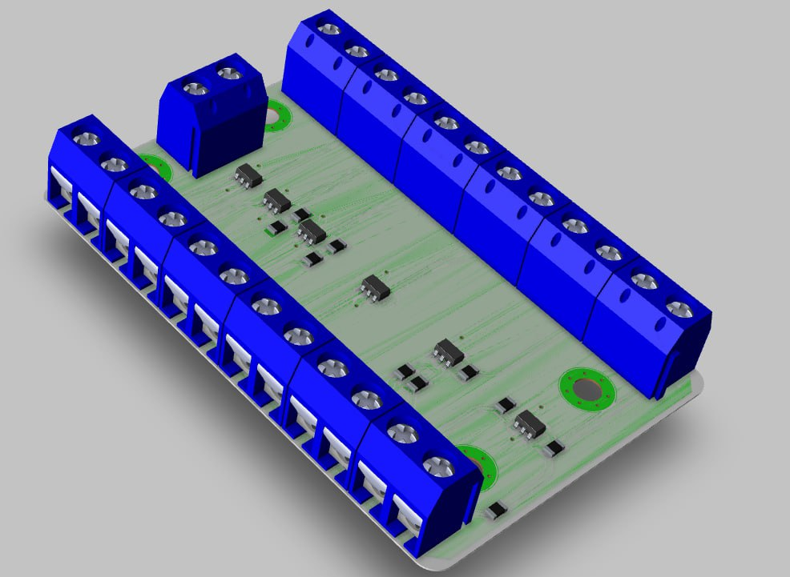

# OP-AMP-eval-board

**Учебная плата-подборка типовых схем включения операционного усилителя на LMV321B-TR.**

Набор из шести классических схем на операционных усилителях, собранных на одной плате — от компаратора до дифференциального усилителя. Каждая схема выполнена отдельным блоком на ОУ **LMV321B-TR** с двуполярным питанием **±5 В** и выведенными разъёмами входов/выходов, что удобно для измерений и наглядного изучения. Спроектирована в Cadence.

## Обзор

- **Название проекта:** OP-AMP-eval-board
- **Назначение:** наглядный набор типовых схем включения операционного усилителя
- **ОУ:** LMV321B-TR (одиночный малопотребляющий операционный усилитель)
- **Питание:** двуполярное ±5 В
- **САПР:** Cadence

## Состав платы

| Схема | Назначение | Передаточная функция | Номиналы |
|---|---|---|---|
| **Voltage Comparator** | Компаратор напряжения | Vout = Vs+ при V1 > V2; Vs− при V1 < V2 | — |
| **Non-Inverting Amplifier** | Неинвертирующий усилитель | Vout = Vin · (1 + R2/R1) | R1 = 10 кОм, R2 = 6 кОм (≈ ×1.6) |
| **Inverting Amplifier** | Инвертирующий усилитель | Vout = −Vin · (R2/R1) | R1 = 10 кОм, R2 = 16 кОм (×−1.6) |
| **Voltage Follower** | Повторитель напряжения (буфер) | Vout = Vin | — |
| **Inverting Summing Amplifier** | Инвертирующий сумматор | Vout = −Rf · (V1/R1 + V2/R2) | R1 = R2 = 10 кОм, Rf = 16 кОм |
| **Differential Amplifier** | Дифференциальный усилитель | Vout = (R2/R1) · (V2 − V1), при R1 = R3, R2 = R4 | R1 = R3 = 10 кОм, R2 = R4 = 16 кОм (×1.6) |

## Ключевые особенности

- **Шесть базовых включений ОУ** — компаратор, неинвертирующий и инвертирующий усилитель, повторитель, сумматор, дифференциальный усилитель на одной плате
- **Единый ОУ LMV321B-TR** — каждый блок собран на отдельном экземпляре (DA1…DA6)
- **Двуполярное питание ±5 В** — корректная работа всех схем, включая компаратор и дифференциальный усилитель
- **Выведенные разъёмы входов/выходов** — для каждой схемы свои клеммы под подачу сигналов и съём результата
- **Наглядность** — на каждой схеме приведены передаточная функция и расчётные номиналы

## Что на плате

| Блок | Назначение |
|---|---|
| DA1 — компаратор | Сравнение двух напряжений |
| DA2 — неинвертирующий усилитель | Усиление без инверсии (×1.6) |
| DA3 — инвертирующий усилитель | Усиление с инверсией (×−1.6) |
| DA4 — повторитель | Буфер с единичным усилением |
| DA5 — инвертирующий сумматор | Сложение двух сигналов с усилением |
| DA6 — дифференциальный усилитель | Усиление разности сигналов (×1.6) |
| Разъёмы входов/выходов | Подача сигналов и съём результата по каждой схеме |
| Монтажные отверстия | X8…X11 |

## Применение

- Наглядное изучение типовых включений операционного усилителя
- Лабораторный стенд для измерения АЧХ/коэффициентов усиления
- Учебное пособие по аналоговой схемотехнике
- Быстрая проверка поведения схем на реальном ОУ

## Среда разработки

- **Схема и плата:** Cadence
